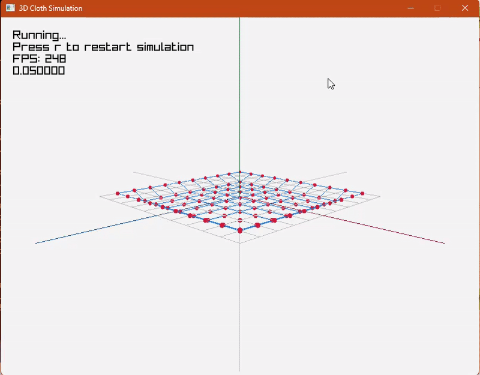
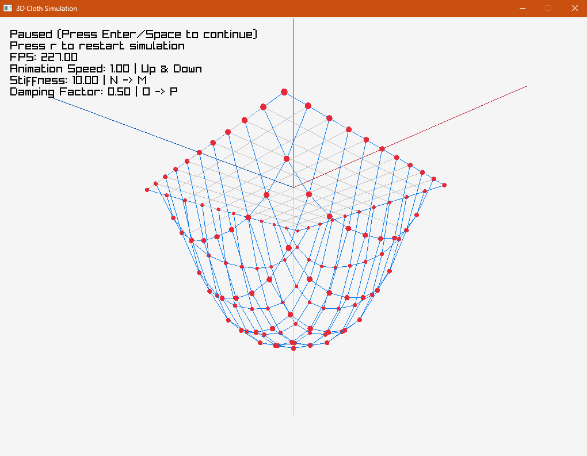

# Mesh3D

A simple project using raylib to simulate a 3D mesh.

## Features

- Adjustable mesh sizes
- Adjustable stiffness
- Adjustable damping factor
- Adjustable animation speed
- Adjustable camera position

## Controls

- `mouse` to control the camera to rotate, to zoom in/out
- `r` to restart the simulation
- `space`/`enter` to pause the simulation
- `up`/`down` to increase/decrease the animation speed
- `n`/`m` to increase/decrease the stiffness
- `d`/`f` to increase/decrease the damping factor

## Download exe file

[Download](./bin/Debug/Mesh3D.exe)
